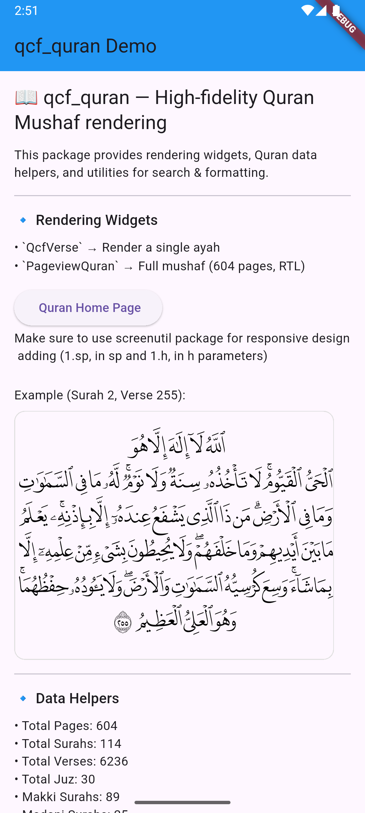

# qcf_quran

[English](README.md) | العربية
<p align="center">
  
  
</p>

عرض مصحف عالي الدقة في Flutter باستخدام مجموعة خطوط QCF (Quranic Computer Font). تتضمن الحزمة خطوطًا لكل صفحة (604 صفحة) مع أدوات تساعدك على:

- عرض المصحف كاملًا مع التمرير بين الصفحات من اليمين إلى اليسار.
- عرض آية واحدة بخط الصفحة الصحيح مع رمز نهاية الآية.
- الاستعلام عن البيانات مثل أرقام الصفحات وأسماء السور/الأجزاء وعدد الآيات والبحث في النص العربي.

ملاحظة: تحتوي الحزمة على 604 ملف خط منفصل (لكل صفحة)، لذلك فإن حجم الحزمة كبير نسبيًا بسبب تضمين هذه الخطوط.

## المزايا

- مصحف مطابق للصفحات الأصلية باستخدام خطوط QCF الداخلية (604 صفحة)
- `PageviewQuran`: صفحات أفقية قابلة للتمرير RTL وتطبيق الخط المناسب لكل صفحة تلقائيًا
- `QcfVerse`: عرض آية واحدة بالخط الصحيح ورقم الآية
- أدوات وبيانات:
  - البحث `searchWords(…)`
  - الأسماء: أسماء السور بالعربية والإنجليزية
  - التهيئة النصية: `normalise(…)` و `removeDiacritics(…)`

## البدء السريع

1) أضف الاعتماد إلى `pubspec.yaml` في تطبيقك:

```yaml
dependencies:
  qcf_quran: ^0.0.1
```

2) الحزمة تتضمن الخطوط المطلوبة مسبقًا. لا حاجة لإضافة أصول إضافية في تطبيقك.

## الاستخدام

### عرض آية واحدة

```dart
import 'package:flutter/material.dart';
import 'package:qcf_quran/qcf_quran.dart';

class SingleVerseDemo extends StatelessWidget {
  const SingleVerseDemo({super.key});

  @override
  Widget build(BuildContext context) {
    return const Directionality(
      textDirection: TextDirection.rtl,
      child: QcfVerse(
        surahNumber: 1, // الفاتحة
        verseNumber: 1,
      ),
    );
  }
}
```

### المصحف مع التمرير بين الصفحات

```dart
MaterialApp(
  home: Scaffold(
    body: PageviewQuran(
      initialPageNumber: 1,
      onPageChanged: (page) {
        // التعامل مع تغيّر الصفحة (1..604)
      },
    ),
  ),
);
```

#### المصحف مع التمرير (Responsive باستخدام ScreenUtil)

```dart
import 'package:flutter_screenutil/flutter_screenutil.dart';
import 'package:qcf_quran/qcf_quran.dart';

// داخل build (تأكد من تهيئة ScreenUtil)
PageviewQuran(
  initialPageNumber: 1,

  ///sp for responsiveness
  sp: 1.sp,

  ///h for responsiveness
  h: 1.h,
  textColor: Colors.black,
  onLongPress: (surah, verse) {
    print("Long Pressed on verse $surah:$verse");
  },
  onLongPressUp: (surah, verse) {
    print("Long Press Up on verse $surah:$verse");
  },
  onLongPressCancel: (surah, verse) {
    print("Long Press Cancel on verse $surah:$verse");
  },
  onLongPressDown: (surah, verse, details) {
    print(
        "Long Press Down on verse $surah:$verse @ ${details.globalPosition}");
  },
),
```

## لقطات شاشة

<p align="center">
  
  
</p>

## ملاحظات

- الخطوط مخصصة لكل صفحة. استخدم دائمًا عائلة خط الصفحة (يتم ذلك داخليًا في `QcfVerse` و`PageviewQuran`).
- اتجاه العرض من اليمين إلى اليسار.
- لأفضل استجابة وتنسيق، استخدم `flutter_screenutil`، ومرّر `sp` و`h` إلى `PageviewQuran` (مثلًا: `sp: 1.sp`, `h: 1.h`) بعد تهيئة ScreenUtil في تطبيقك.

## الترخيص

MIT للكود. خطوط QCF مقدمة من مجمع الملك فهد لطباعة المصحف الشريف. يُرجى الالتزام بشروطهم عند توزيع التطبيقات.

## الشكر

- خطوط QCF من مجمع الملك فهد
- مصادر البيانات في `lib/src/data/`
